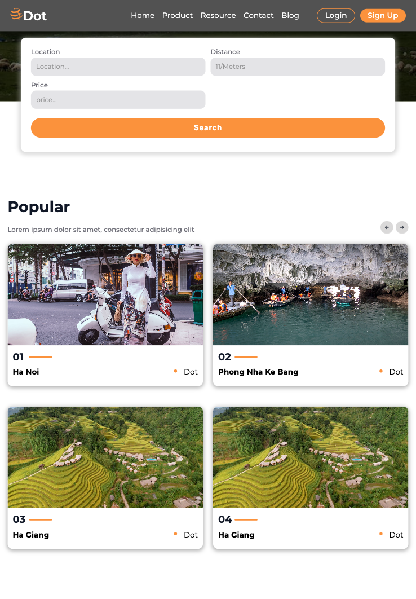
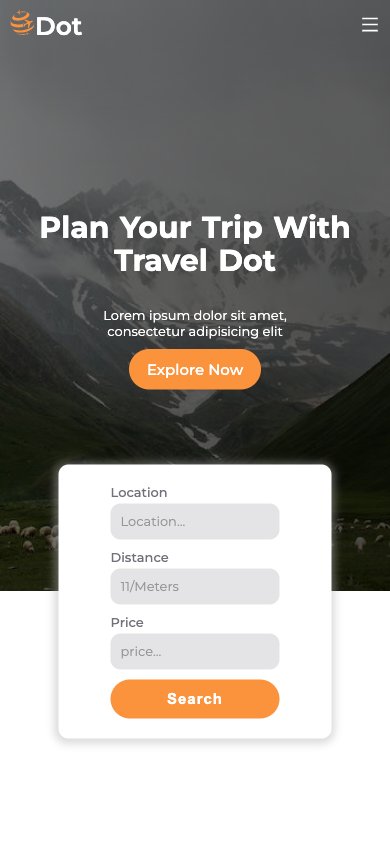
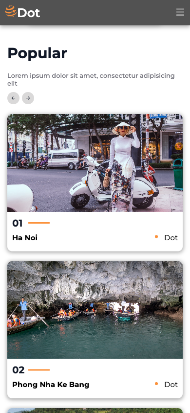

# Responsive react Travel with Vite

# Review

## Laptop


## Ipad



## Mobile




# Build with

- [Vitejs](https://vitejs.dev/)
- React-icon
- Image from Pexels or Unsplash
- [Aos Library for Animations](https://michalsnik.github.io/aos/)

# Install

```
npm create vite@latest
```

```
npm i eslint vite-plugin-eslint eslint-config-react-app --save-dev
```

## Run (different creacte-react-app)

```
npm run dev
```

### Prettier

[Link](https://github.com/tailwindlabs/prettier-plugin-tailwindcss)

```
npm install -D prettier prettier-plugin-tailwindcss
```

rename file "prettier.config.js" to "prettier.config.cjs"

```
module.exports = {
  plugins: [require('prettier-plugin-tailwindcss')],
}

```

### AOS - animation

```
npm install aos --save
```

**use**

```
import Aos from 'aos';
import 'aos/dist/aos.css';
```
